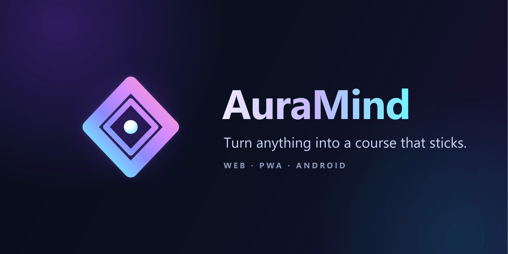

<div align="center">
  
</div>

# AuraMind

<div align="center">

[](https://github.com/mattycigemp-crypto/AuraMind-App-2/actions/workflows/ci.yml)
[](https://github.com/mattycigemp-crypto/AuraMind-App-2/network/dependencies)
[](https://github.com/prettier/prettier)
[](https://www.typescriptlang.org)
[](#license)

[🚀 Quick Start](#quick-start) ·
[🤝 Contributing](./CONTRIBUTING.md) ·
[🔒 Security](./SECURITY.md) ·
[📜 Code of Conduct](./CODE_OF_CONDUCT.md)

</div>

An **adaptive AI learning system** — turn anything you're studying (a PDF, a video, a lecture, a topic) into a personalized course of cards, lessons, and quizzes. FSRS v5 spaced repetition schedules your reviews; Prof. Aura, the AI tutor, remembers what you actually struggle with — weak cards, concepts, retention, and past conversations — and teaches to those gaps. Freemium via Stripe, all in one repo.

> **Status:** active development · pre-M6 release · deployed via Vercel (web) with an active Capacitor 8 Android build.
>
> The Tauri 2 desktop stack remains archived. The Android app uses the shared
> learning UI plus native status-bar/back navigation, haptics, local study
> reminders, system sharing, and mobile navigation.

## ✅ What's in here

- **Web app** — React 19 + Vite 6 + Tailwind, served by Vercel (PWA with offline support).
- **Backend** — Vercel serverless functions under `/api`.
- **Database** — Supabase (Postgres) with append-only migrations in `./supabase/migrations/`.

## 🚀 Quick Start

### Prerequisites

- Node.js 18+
- npm or yarn
- Git

### Local Development

1. **Clone the repository**
   ```bash
   git clone https://github.com/mattycigemp-crypto/AuraMind-App-2.git
   cd AuraMind-App-2
   ```

2. **Install dependencies**
   ```bash
   # Install root dependencies
   npm install
   
   # Install frontend dependencies
   cd auramind-gemini
   npm install
   cd ..
   ```

3. **Set up environment variables**
   
   Copy the example environment file:
   ```bash
   cp auramind-gemini/.env.example auramind-gemini/.env
   ```
   
   Edit `auramind-gemini/.env` and add your credentials:
   ```env
   # AI Configuration (choose one or more)
   VITE_GROQ_API_KEY=your_groq_api_key_here
   VITE_OPENROUTER_API_KEY=your_openrouter_api_key_here
   
   # Supabase Configuration (REQUIRED)
   VITE_SUPABASE_URL=your_supabase_url_here
   VITE_SUPABASE_ANON_KEY=your_supabase_anon_key_here
   
   # Stripe Configuration (for payments)
   VITE_STRIPE_PUBLISHABLE_KEY=your_stripe_publishable_key_here
   VITE_STRIPE_PRICE_ID_MONTHLY=price_1TqjKHGhRq84JnUVogflTfeY
   VITE_STRIPE_PRICE_ID_ANNUAL=price_1SNlxOGhRq84JnUV1DzlFMS8

   # Email Configuration (IMPORTANT: Must use verified domain in Resend)
   RESEND_FROM_EMAIL=noreply@mail.auramind.app
   RESEND_API_KEY=your_resend_api_key_here
   ```

   > **⚠️ Which keys ship to the browser.** Everything prefixed `VITE_` is
   > inlined into the public JS bundle at build time — treat those as
   > public, never as secrets. `RESEND_API_KEY` and `GOOGLE_SEARCH_API_KEY`
   > are **not** `VITE_`-prefixed: they are read server-side only (in the
   > `/api` functions) and must never be prefixed with `VITE_`. The Google
   > Custom Search and email calls go through the API proxy so no third-
   > party key leaves the server.
   >
   > **Groq BYOK fallback (intentional).** `VITE_GROQ_API_KEY` deliberately
   > ships in the bundle: it's a developer-funded fallback so users without
   > their own key still get free AI (falls back to Ollama otherwise). To
   > ship a production build *without* that key, create
   > `auramind-gemini/.env.production` with `VITE_GROQ_API_KEY=` (empty) —
   > Vite gives it priority over `.env`, and AI then requires each user's
   > own key (or Puter).

4. **Start the development server**
   ```bash
   npm run dev
   ```
   
   The app will be available at `http://localhost:3000`

## 📁 Project Structure

```
AuraMind App 2/
├── api/                      # Backend API routes (Vercel serverless)
│   ├── check-subscription.ts
│   ├── create-checkout-session.ts
│   ├── stripe-webhook.ts
│   └── ...
├── auramind-gemini/          # Frontend React application
│   ├── src/
│   │   ├── components/       # React components
│   │   ├── services/         # API and business logic
│   │   ├── hooks/           # Custom React hooks
│   │   ├── types/           # TypeScript type definitions
│   │   └── data/            # Static data and sample content
│   ├── public/               # Static assets
│   └── package.json
├── vercel.json              # Vercel deployment configuration
├── package.json             # Root package.json (scripts)
└── .gitignore
```

## 🔧 Environment Variables

### Required Variables

| Variable | Description | Where to get |
|----------|-------------|--------------|
| `VITE_SUPABASE_URL` | Supabase project URL | Supabase Dashboard → Settings → API |
| `VITE_SUPABASE_ANON_KEY` | Supabase anonymous key | Supabase Dashboard → Settings → API |
| `RESEND_FROM_EMAIL` | Sender email for notifications (must use verified domain) | Resend Dashboard → Domains |
| `RESEND_API_KEY` | Resend API key for email sending | Resend Dashboard → API Keys |

### Optional Variables

| Variable | Description | Default |
|----------|-------------|---------|
| `VITE_GROQ_API_KEY` | Groq AI API key (fastest free tier) | - |
| `VITE_OPENROUTER_API_KEY` | OpenRouter API key (multiple models) | - |
| `VITE_USE_LOCAL_AI` | Enable local AI server (LM Studio/Ollama) | `false` |
| `VITE_AI_MODEL` | Custom AI model selection | `deepseek/deepseek-r1-0528:free` |
| `VITE_STRIPE_PUBLISHABLE_KEY` | Stripe publishable key | - |
| `VITE_STRIPE_PRICE_ID_MONTHLY` | Stripe monthly price ID | - |
| `VITE_STRIPE_PRICE_ID_ANNUAL` | Stripe annual price ID | - |
| `VITE_POSTHOG_KEY` | PostHog analytics key | - |

### Backend Environment Variables (Vercel)

These should be set in Vercel project settings:

| Variable | Description |
|----------|-------------|
| `STRIPE_SECRET_KEY` | Stripe secret key |
| `STRIPE_WEBHOOK_SECRET` | Stripe webhook signing secret |
| `SUPABASE_SERVICE_ROLE_KEY` | Supabase service role key |
| `RESEND_API_KEY` | Resend API key for emails |
| `RESEND_FROM_EMAIL` | Verified sender email domain (must end with @mail.auramind.app) |

## 🏗️ Build & Deployment

### Local Build

```bash
cd auramind-gemini
npm run build
```

### Vercel Deployment

1. **Install Vercel CLI**
   ```bash
   npm install -g vercel
   ```

2. **Deploy to Vercel**
   ```bash
   vercel
   ```

3. **Set environment variables in Vercel Dashboard**
   - Go to your Vercel project → Settings → Environment Variables
   - Add all required variables from the table above

4. **Deploy to production**
   ```bash
   vercel --prod
   ```

### Watch Mode (Auto-deploy)

For continuous development with auto-deployment:

```bash
npm run watch
```

This will:
- Watch for file changes in `auramind-gemini/` and `api/`
- Automatically build the frontend
- Deploy to Vercel production

## 🧪 Testing

### Run Tests

```bash
cd auramind-gemini
npm test
```

### Type Checking

```bash
cd auramind-gemini
npm run type-check
```

## 🔑 API Services Setup

### Supabase Setup

1. Create a new project at [supabase.com](https://supabase.com).
2. Apply the migrations from [`supabase/migrations/`](./supabase/migrations/)
   in **time-stamp order** via the Supabase SQL Editor. They are append-only
   and idempotent — each picks up where the previous one left off, and every
   one writes a bookkeeping row to `schema_migrations`.

   **The schema is intentionally NOT reproduced in this README.**
   It goes stale as soon as the next migration ships. The directory of
   numbered `.sql` files is the single source of truth, and
   `schema_migrations.ORDER BY applied_at DESC` tells you which ones
   the live DB currently has.

To check what has been applied:

```sql
SELECT version, applied_at, description
FROM   schema_migrations
ORDER  BY applied_at DESC;
```

### Stripe Setup

1. Create a Stripe account at [stripe.com](https://stripe.com)
2. Create products and prices for subscriptions
3. Add webhook endpoint for your Vercel deployment
4. Configure webhook events:
   - `checkout.session.completed`
   - `customer.subscription.created`
   - `customer.subscription.updated`
   - `customer.subscription.deleted`
   - `invoice.payment_succeeded`
   - `invoice.payment_failed`

### Resend Setup (Email)

1. Create account at [resend.com](https://resend.com)
2. Verify your domain (e.g., `auramind.app`)
3. Create API key
4. Set `RESEND_FROM_EMAIL` to a verified address on your domain

## 🎨 Features

- **AI tutor (Prof. Aura)** — a conversational coach that remembers your weak cards, concepts, retention, and past conversations, then teaches to the gaps.
- **AI generation** — turn a topic, PDF, video, URL, or voice memo into flashcards, quizzes, and narrated slides.
- **FSRS v5 spaced repetition** — reviews scheduled by the Free Spaced Repetition Scheduler, not a fixed interval.
- **Native Android app** — Capacitor 8 shell with status-bar/back navigation, haptics, local reminders, system sharing, and offline study.
- **Offline-first PWA** — cached decks and cards, queued reviews, and reconnect sync.
- **Voice study** — text-to-speech cards and hands-free review.
- **Gamification** — streaks, mastery stats, and progress analytics.
- **Freemium via Stripe** — subscription checks, webhooks, and entitlement fallback.
- **Multiple AI providers** — Groq, OpenRouter, and local (Ollama/LM Studio), with a user-pays Puter fallback.

## 📊 Tech Stack

- **Frontend**: React 19, TypeScript, Vite, Tailwind CSS
- **UI Components**: Radix UI, Framer Motion, custom SVG icon set
- **Backend**: Vercel Serverless Functions
- **Database**: Supabase (PostgreSQL)
- **Payments**: Stripe
- **Email**: Resend
- **AI**: Groq, OpenRouter, Local AI (Ollama/LM Studio)

## 🐛 Troubleshooting

### Build Errors

If you encounter build errors:

```bash
# Clear cache and reinstall
cd auramind-gemini
rm -rf node_modules package-lock.json
npm install
```

### Environment Variables Not Loading

- Ensure your `.env` file is in the `auramind-gemini/` directory
- Restart the development server after changing environment variables
- Variables must start with `VITE_` to be available in the browser

### API Errors

- Check that all backend environment variables are set in Vercel
- Verify Supabase connection string and credentials
- Ensure Stripe webhook is properly configured

## 📝 License

Proprietary — All rights reserved. © 2026 CogniVect, Inc.
AuraMind and the AuraMind mark are trademarks of CogniVect, Inc.
No part of this codebase is licensed for redistribution.

## 📚 Governance

- [CONTRIBUTING.md](./CONTRIBUTING.md) — local setup, branch + commit
  conventions, schema migration rules, and PR expectations.
- [SECURITY.md](./SECURITY.md) — how to privately report a vulnerability
  and the SLAs the maintainer commits to.
- [CODE_OF_CONDUCT.md](./CODE_OF_CONDUCT.md) — community norms
  (Contributor Covenant v2.1).

## 🤝 Support

- Bug reports → open an issue using the
  [Bug Report template](./.github/ISSUE_TEMPLATE/bug_report.yml).
- Feature ideas → open an issue using the
  [Feature Request template](./.github/ISSUE_TEMPLATE/feature_request.yml).
- Security issues → see [SECURITY.md](./SECURITY.md); do **not** open
  a public issue.